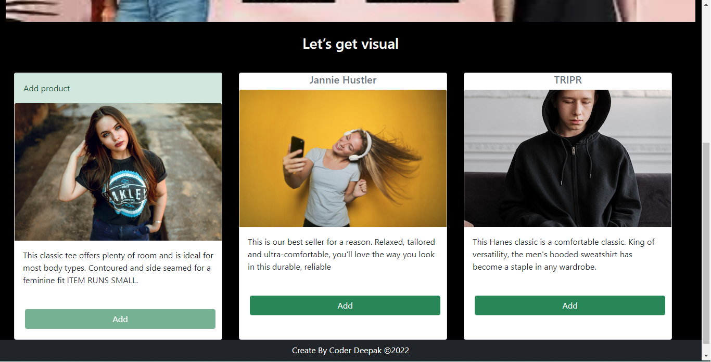
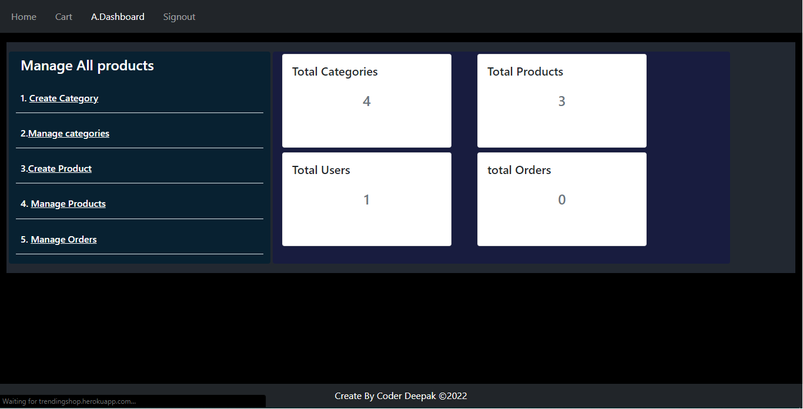
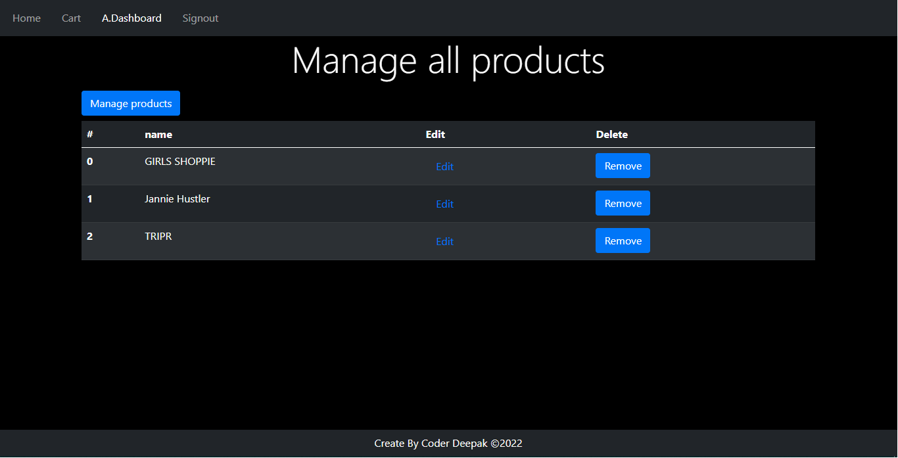
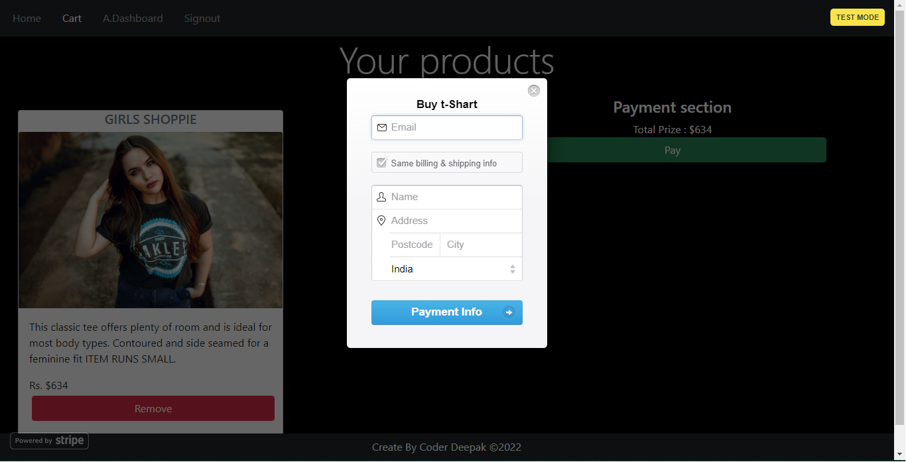

Hi✋

**This is shopping website**

[Click to check out](https://shopcy.netlify.app/)

## Project description

**User :**
`User can view all products and add products to cart without signing in . After signing in, the user can buy the product.`

**Admin :**
` Admin can create products, create categories, manage products and categories, delete and update each item`

## Useges Technology

### `I am using react and bootstrap dark theme to build this project and using local-storage and cookie to store user information and authentication . Added Stripe Payments integration with secure payments . For save user information i am using mongodb . Writing the backend using NodeJS`

**This is Open source project**

Overview

